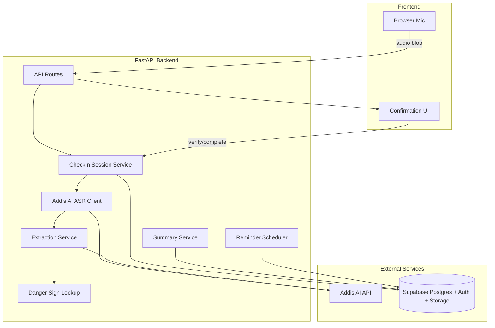

# EnatAI Backend — Project Plan

Operational guide for the voice-based Amharic clinical intake backend.

## Architecture



### Service responsibilities

| Service | File | Responsibility |
|---|---|---|
| Addis AI client | `backend/app/services/addis_ai.py` | ASR transcription and LLM JSON extraction |
| Extraction | `backend/app/services/extraction.py` | Stage-specific prompts, Pydantic validation, retry logic |
| Danger signs | `backend/app/services/danger_signs.py` | Deterministic danger-sign lookup |
| Check-in session | `backend/app/services/checkin_session.py` | Multi-stage session state machine |
| Summary | `backend/app/services/summary.py` | Aggregation and immutable snapshot creation |
| QR | `backend/app/services/qr.py` | QR PNG generation and Supabase Storage upload |
| Reminders | `backend/app/services/reminders.py` | Daily reminder job and pending reminder queries |

### Clinical safety rule

The LLM is used only for transcription and structured extraction. `danger_sign: true` is **always** recomputed server-side via `check_danger_sign(category)` against the fixed `DANGER_SIGN_CATEGORIES` list in `backend/app/core/constants.py`. Nothing is written to `check_ins` or `summaries` until the user confirms extracted items.

---

## Setup

### Prerequisites

- Python 3.11+
- Supabase project
- Addis AI API key

### 1. Supabase

1. Create a Supabase project.
2. Run [`backend/migrations/001_initial_schema.sql`](backend/migrations/001_initial_schema.sql) in the SQL editor.
3. Create a public storage bucket named `summary-qr-codes`.
4. Copy the project URL, service role key, and JWT secret.

### 2. Environment

Copy `backend/.env.example` to `backend/.env`:

```env
SUPABASE_URL=https://your-project.supabase.co
SUPABASE_SERVICE_ROLE_KEY=your-service-role-key
SUPABASE_JWT_SECRET=your-jwt-secret
ADDIS_API_KEY=your-addis-api-key
ADDIS_API_BASE_URL=https://api.addisassistant.com
PUBLIC_BASE_URL=http://localhost:3000
CORS_ORIGINS=http://localhost:3000,http://localhost:5173
ENABLE_DEV_ROUTES=false
REMINDER_CRON_HOUR=6
```

### 3. Install and run

```bash
cd backend
pip install -r requirements.txt
uvicorn app.main:app --reload
```

Health check: `GET http://localhost:8000/health`

---

## Database schema

### Core tables

- `users` — app user profile synced with Supabase Auth
- `supplements` — active supplement configuration and reminder time
- `appointments` — ANC appointment date and summary generation watermark
- `check_ins` — finalized, confirmed daily intake records
- `summaries` — immutable clinician-readable snapshots

### Supporting tables

- `check_in_sessions` — ephemeral multi-step session state
- `reminders` — queued in-app reminders

See [`backend/migrations/001_initial_schema.sql`](backend/migrations/001_initial_schema.sql) for full DDL.

---

## API reference

Base URL: `http://localhost:8000`

Authenticated routes require `Authorization: Bearer <supabase_jwt>`.

### Auth

| Method | Path | Description |
|---|---|---|
| POST | `/auth/signup` | Create account |
| POST | `/auth/login` | Login and receive JWT |

Example signup:

```json
POST /auth/signup
{
  "email": "user@example.com",
  "password": "securepass"
}
```

### Users

| Method | Path | Description |
|---|---|---|
| GET | `/users/me` | Current user profile |
| POST | `/users/me/supplements` | Create supplement |
| PUT | `/users/me/supplements/{id}` | Update supplement |
| POST | `/users/me/appointment` | Create appointment |
| PUT | `/users/me/appointment` | Update appointment |

### Check-in flow

| Method | Path | Description |
|---|---|---|
| POST | `/checkin/start` | Start session, return first stage |
| POST | `/checkin/{session_id}/respond` | Upload audio, get transcript + extracted items |
| POST | `/checkin/{session_id}/verify` | Confirm or reject extracted item |
| POST | `/checkin/{session_id}/complete` | Complete current stage or finalize check-in |
| GET | `/checkin/history` | List past check-ins |

Stage order:

1. `symptoms`
2. `food`
3. `supplement` — only if user has an active supplement
4. `closing`

Example verify request:

```json
POST /checkin/{session_id}/verify
{
  "item_id": "uuid",
  "confirmed": true,
  "corrected_value": {
    "category": "severe_headache"
  }
}
```

### Summary

| Method | Path | Auth | Description |
|---|---|---|---|
| POST | `/summary/generate` | Yes | Generate new snapshot |
| GET | `/summary/latest` | Yes | Latest summary for user |
| GET | `/summary/public/{slug}` | No | Public read-only snapshot |

Public endpoint returns only `period_start`, `period_end`, `generated_at`, and `content_json`.

### Reminders

| Method | Path | Description |
|---|---|---|
| GET | `/reminders` | Pending reminders for user |
| POST | `/reminders/run-daily` | Manual trigger when `ENABLE_DEV_ROUTES=true` |

Daily job logic:

- No appointment → `set_appointment` reminder
- Active supplement → supplement reminder at configured time
- Appointment within lead days → `appointment_approaching` reminder + auto summary generation

---

## Addis AI integration

| Capability | Endpoint | Notes |
|---|---|---|
| ASR | `POST /api/v2/stt` | Multipart audio + `request_data={"language_code":"am"}` |
| LLM extraction | `POST /api/v1/chat_generate` | Low temperature, JSON-only system prompt |

Dev ASR test route (when `ENABLE_DEV_ROUTES=true`):

```bash
curl -X POST http://localhost:8000/dev/asr-test \
  -H "x-api-key: ignored" \
  -F "audio=@sample.wav"
```

Extraction retries up to 3 times on malformed JSON. Unvalidated LLM output is never passed downstream.

---

## Demo walkthrough

1. Sign up: `POST /auth/signup`
2. Configure supplement: `POST /users/me/supplements`
3. Set appointment: `POST /users/me/appointment`
4. Start check-in: `POST /checkin/start`
5. Respond with audio: `POST /checkin/{session_id}/respond`
6. Confirm each extracted item: `POST /checkin/{session_id}/verify`
7. Complete each stage: `POST /checkin/{session_id}/complete`
8. Repeat respond/verify/complete until session completes
9. Generate summary: `POST /summary/generate`
10. Open public link: `GET /summary/public/{share_link_slug}`

If a confirmed symptom maps to a danger-sign category, the final `complete` response returns `danger_sign_triggered: true`.

---

## Tests

```bash
cd backend
pytest tests -v
```

Coverage includes:

- Danger-sign deterministic lookup
- Extraction validation and retry behavior
- Check-in session stage ordering and verification
- Summary aggregation and public summary field isolation

---

## Deployment notes

MVP target is local development with `uvicorn`. For production:

- Run behind HTTPS reverse proxy
- Store secrets in environment variables or secret manager
- Use managed Supabase project with RLS policies reviewed
- Set `ENABLE_DEV_ROUTES=false`
- Configure `PUBLIC_BASE_URL` to production frontend URL for QR codes

### Known MVP limitations

- In-app reminders only (no SMS/telephony)
- No doctor accounts or patient search
- No nutrition scoring or clinical advice
- Amharic check-in flow only
- Backend uses service-role Supabase access with app-level user scoping

---

## Build phases completed

1. Scaffolding, config, and FastAPI app shell
2. Database migrations and repository layer
3. Auth and user setup endpoints
4. Addis AI ASR/LLM client with dev test route
5. Check-in session pipeline with danger-sign enforcement
6. All four check-in stages including conditional supplement stage
7. Summary generation, QR upload, and public read-only view
8. Daily reminder scheduler and pending reminder endpoint
9. Unit/integration tests
10. This project plan document
